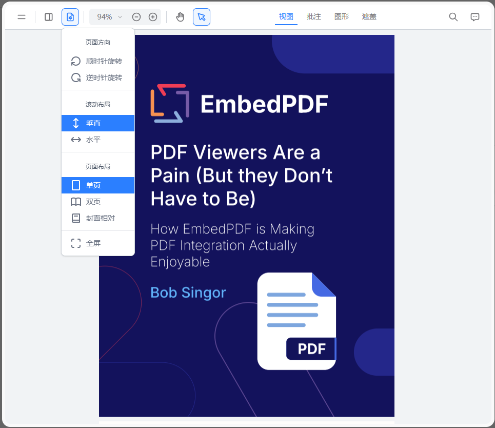

# embed-pdf-viewer-localization
EmbedPDF Snippet  汉化组件  直接引用即可汉化



```js
//TranslatePDF.ts   主文件
//entry.ts   词条表
import { map } from './entry';
import TranslatePDF from './TranslatePDF';
//EmbedPDF.init后加入
//初始化
const container = document.querySelector('embedpdf-container');
t = new TranslatePDF(container?.shadowRoot || container!, map);
//销毁
t.destroy();
```